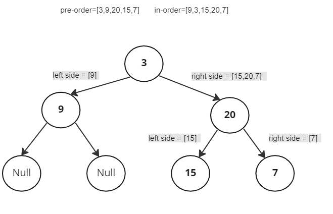

# Tree Challenge-01 Document

## Problem Domain

create a class which return a binary tree based on the given list of pre-order and in-order traversal tree .

**Input** : in-order=[9,3,15,20,7] , pre-order=[3,9,20,15,7]

**Output** : [3,9,20,null,null,15,7]

## Test Cases

- input : in-order=[9,3,15,20,7] pre-order=[3,9,20,15,7], Output: [3,9,20,null,null,15,7]
- input : in-order=[-1] pre-order=[-1], Output:[-1]
- input : in-order=[1,2] pre-order=[2,1], Output: [2,1,null]
- input : in-order=[] pre-order=[], Output: [null]
- input : in-order=['a','b','c'] pre-order=['b','a','c'], Output: ['b','a','c']


## Visualize




## Algorithm


- Create a node class accepts a value.
- Create a method inside a tree class which accepts the pre-order and in-order traversal tree.
- firstly the method will check each value in pre-order from starting from the first value of the list, and consider it as a root.
- based on the in-order list , the method will check each root if they are having a sub root(left or right values), by using recursion.
- the method will return each root. 


## Big O


The time complexity and space will depends on the amount of pre_order and in_order inputs length, as the function will loop  recursively.


**Time** :  O(N^2)

**Space**: O(N^2)


## Code

```
class Node:

    def __init__(self,value) -> None:
        self.value=value
        self.right=None
        self.left=None

    

class Tree:

    def binary_tree(self, pre_order, in_order):

            if in_order:

                root_idx = in_order.index(pre_order.pop(0))
                root = Node(in_order[root_idx])
                root.left = self.binary_tree(pre_order, in_order[:root_idx])
                root.right = self.binary_tree(pre_order, in_order[root_idx+1:])
                
                return root
        

```
